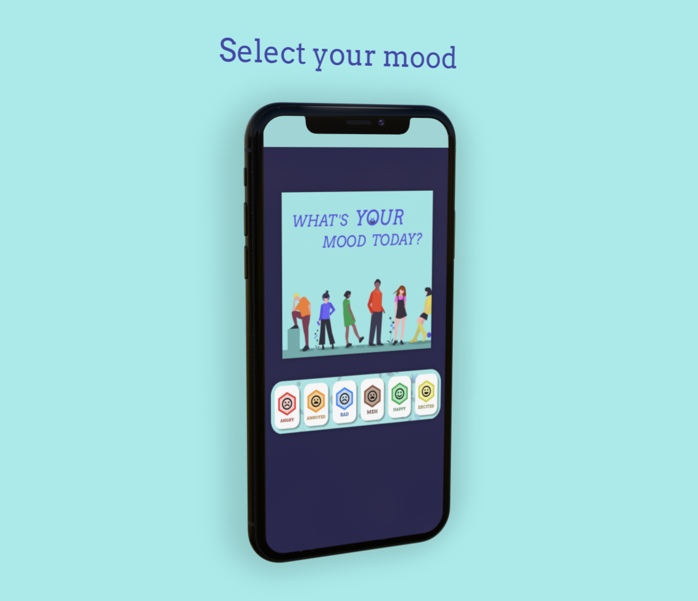
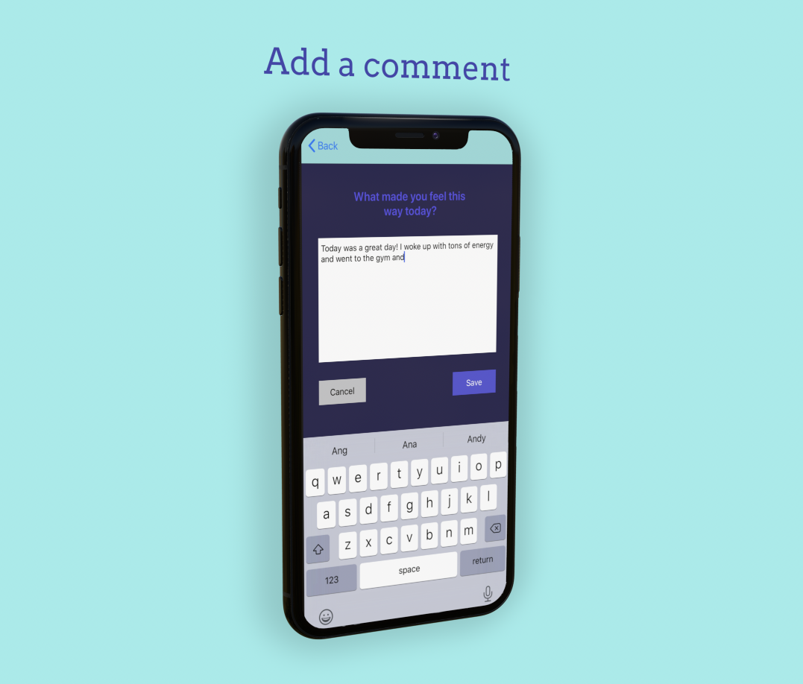
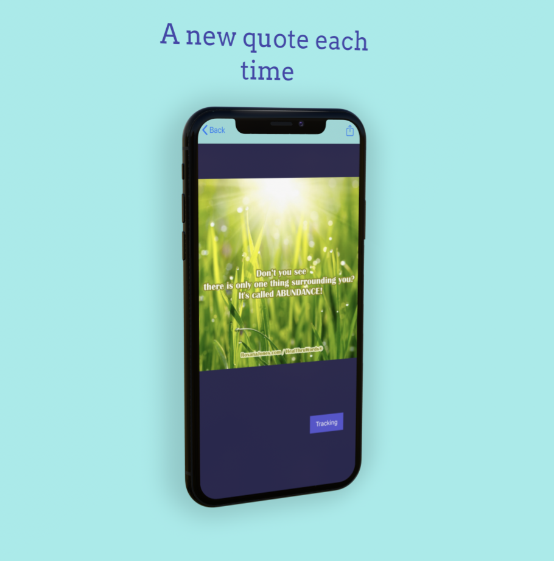
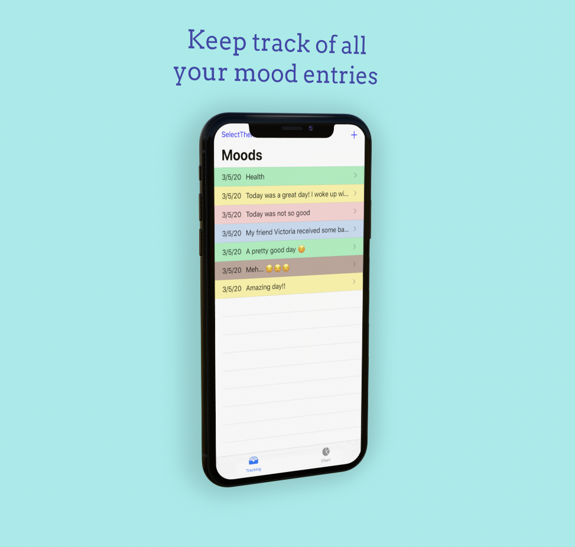
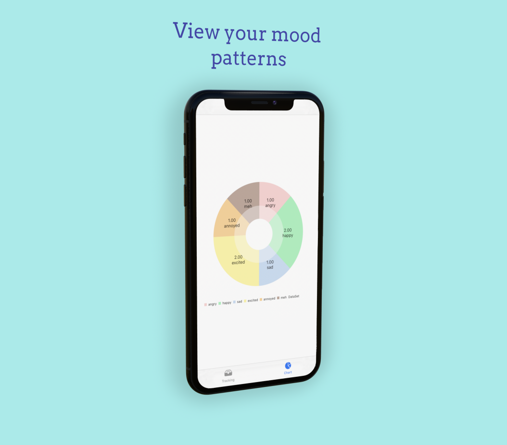
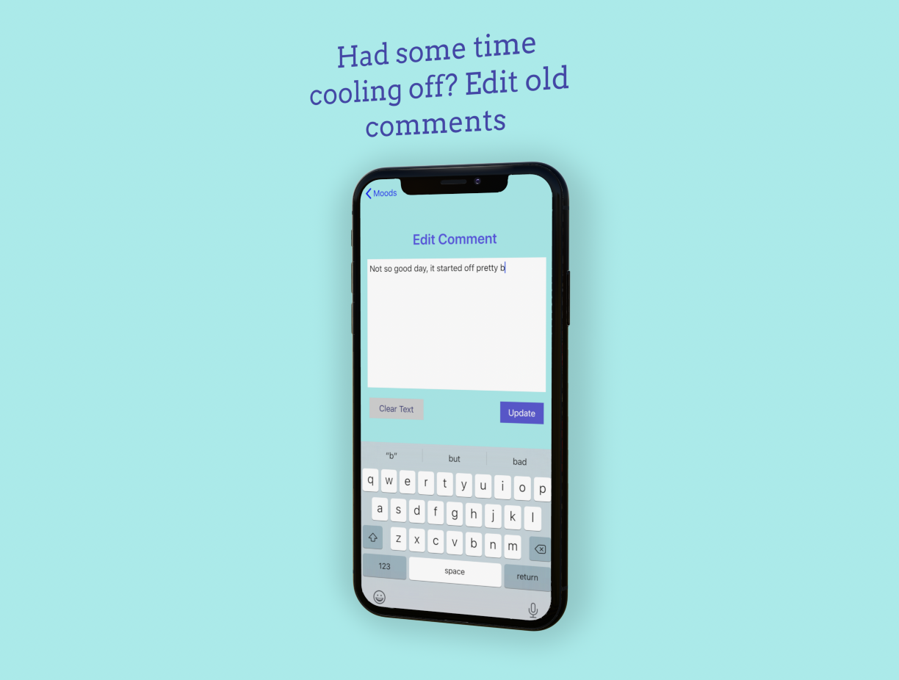
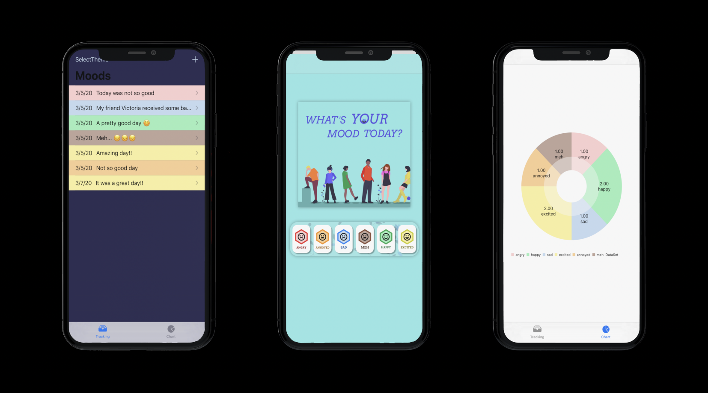

# iOSPT Demo Day

## Requirements
2. <h2>**Moody Me**</h2> </p>
    
    
    
    
    
    </p>
3. Polish your Github Code repository
    1. Add screenshots and an overview to your GitHub Code Repository
    2. You should make that repository the "Public Portfolio" for your project
    3. Look at [John Sundell's Splash project](https://github.com/JohnSundell/Splash) for inspiration (code, images, GIFs)
4. Create a pull request (PR) and **tag your TL and Instructor**

## Links

* Github Proposal: https://github.com/matt-martindale/ios-build-sprint-project-proposal
* Trello/Github Project Kanban: https://www.notion.so/3ee4fdd8057a423bb1e1eb3f8282cc6b?v=c7eff0fd505f465a830043392c30af9d
* YouTube demo video (Recommended): https://youtu.be/hA554KGEtV8

## Hero Image



## Questions (Answer indented below)

1. What was your favorite feature to implement? Why?

    My favorite feature that we implemented was the ability to quickly see what mood you chose and the comment in the tableView. When viewing the tableView you can quickly see what mood you selected for that day by the dynamic color of each cell. And the abiilty to see a preview of the comment you made for that day really helps you get the necessary information at a quick glance.

2. What was your #1 obstacle or bug that you fixed? How did you fix it?

    The biggest obstacle for me was the figuring out how to move the objects through each VC. Thinking back on the project, I would've suggested we really think about the UX and how to setup the app navigation before we start. Saving ourselves a lot of headaches later on as far as passing information around and dealing with the app lifecycle.
    
    So to fix the problem of the objects not being passed around correctly my TL helped me implement dependency injection so the object was ready to move to the next VC and the next VC was ready to receive it.
  
3. Share a chunk of code (or file) you're proud of and explain why.

```
    func updateMoodComment(mood: Mood, comment: String) {
        if let index = moods.firstIndex(of: mood) {
            var mood = moods[index]
            mood.comment = comment
            
            moods[index] = mood
            saveToPersistentStore()
        }
    }
  ```
  This function in the ModelController edits the comment in the cell that the user tapped. It finds the first index of that object and using the index, taps into the comment property and updates it with the new string value.
  
4. What is your elevator pitch? (30 second description your Grandma or a 5-year old would understand)

    Our app is a great way to track your daily moods, and lets you leave a comment for each day so you know what your overall opinion of that day was. It's like a mood tracker and journal entry all-in-one.
  
5. What is your #1 feature?

    Track your daily mood.
  
6. What are you future goals?

    Set a reminder each day to track your mood.

## Required Slides (Add your Keynote to your PR)

1. App Name / Team Slide
2. Elevator Pitch
3. Your #1 Feature (Customer facing — what can I do with your app?)
4. Future Goals

## Slide Requirements

1. 50 pt font minimum
2. Be concise — don't write sentences/paragraphs (put these in your slide notes for speaking)
3. 3-6 bullets maximum per slide
4. Do the squint test (can you read the text if you squint, if so, make the font bigger)
6. Images are always welcome
7. Do the Grandma Test (Would your Grandma understand you?)

### Optional Slides

1. Blooper: What's a funny bug or blooper? (screenshots/GIFs please)
2. Revenue Model: If the app was your sole source of income, how would you monetize it?

## Presentation Format

**7 minutes/team**

* 4 minute presentation (5 minute hard cap)
* 3 minutes of questions

We have ~12 teams presenting today — please practice your presentation with a timer (as a team), and make sure you fit within the time limit.

Plan on having one person present the slides and live demo. Please practice your presentation in front of a mirror or with your team 2-5 times. Have the app running and visible (Simulator or QuickTime) so you can quickly transition between slides and live demo.

* App Name / Team Slide (30 seconds)
* Elevator Pitch Slide (30 seconds)
* Your #1 Feature (30 seconds)
* Live Demo (2 minutes)
* Future Goals (30 seconds)
* Questions (3 minutes)
