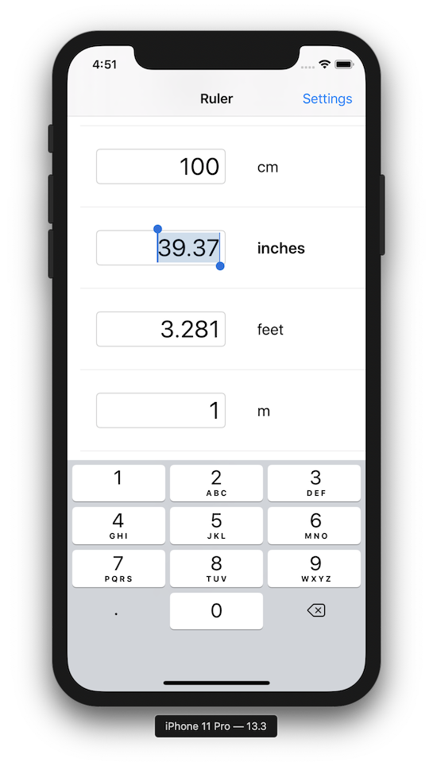

# iOSPT Demo Day

## Requirements

1. Fork and clone the repository
2. **Add your presentation content**
    1. Slide deck (4 required slides)
    2. Links
    3. Answer all questions 
    4. YouTube demo video (1-2 min max)
3. Polish your Github Code repository
    1. Add screenshots and an overview to your GitHub Code Repository
    2. You should make that repository the "Public Portfolio" for your project
    3. Look at [John Sundell's Splash project](https://github.com/JohnSundell/Splash) for inspiration (code, images, GIFs)
4. Create a pull request (PR) and **tag your TL and Instructor**

## Links

* Github Code: https://github.com/iOSPT5-BW1/Unit-Converter-I
* Github Proposal: https://github.com/LambdaSchool/ios-build-sprint-project-proposal/pull/58
* Trello/Github Project Kanban: https://www.notion.so/3a63b0e503ae4d6486c527e086ce0ed3?v=96433557bcb24134bef273f71d89da9e
* Test Flight Signup (Recommended): N/A
* YouTube demo video (Recommended): https://www.youtube.com/watch?v=-9toNCMKtd0

## Hero Image



## Questions (Answer indented below)

1. What was your favorite feature to implement? Why?

    I think my favorite was the calculation logic and storing values, but more on that on #2 and #3.

    I also liked implementing double-tap on the units label to copy the current value to the clipboard. I started out with tap gestures on the whole cell, but they interfered with text input, so I added a button over the right side of the cell (over the units label). A regular single tap selects the unit's text field, which worked fine with the button, but there is no double-tap action for a button, so I added a double-tap gesture on the button, which worked! I wanted temporary feedback to show what happened, so I show and fade out a label saying the value was copied to the clipboard.

2. What was your #1 obstacle or bug that you fixed? How did you fix it?

    My biggest obstacle was figuring out how to fix a calculation bug that caused rounding errors. I started out making each unit store its equivalent value in inches, and always calculating: InputValue -> ValueInInches -> OutputValue, which caused problems with metric units. I solved it by storing metric units as equivalent value in meters, and converting between imperial and metric only when necessary.
  
3. Share a chunk of code (or file) you're proud of and explain why.

    Once I realized I needed to store either an imperial value or a metric value, I decided to create an enum with associated values, which is stored in each unit. I save the current value based on the unit type and its native value.

```swift
enum UnitTypeValue {
    case imperial(Double) // value in inches
    case metric(Double) // value in meters
}

struct Unit {
    let name: String
    let type: UnitTypeValue
}

private func setValue(_ newValue: Double, for unit: Unit) {
    switch unit.type {
    case .imperial(let howManyInches):
        currentValueType = .imperial
        currentValue = newValue * howManyInches
    case .metric(let howManyMeters):
        currentValueType = .metric
        currentValue = newValue * howManyMeters
    }
    NotificationCenter.default.post(name: .valueHasChanged, object: nil)
}
```
  
4. What is your elevator pitch? (30 second description your Grandma or a 5-year old would understand)

    Ruler makes distance unit conversions simple and fast! When the app starts up, tap your unit in the list, enter a value, and instantly see the result in any other distance unit you want! If you need to paste the result in another app, just double-tap on the unit to copy the value to the clipboard!
  
5. What is your #1 feature?

    Instant feedback / Speed / Ease of use
  
6. What are you future goals?

    I'd like to add an option to display less used units, such as microns, mils, leagues, fathoms, etc. Another feature to add would be a ruler that would display on the phone screen, to measure smaller items.

## Required Slides (Add your Keynote to your PR)

1. App Name / Team Slide
2. Elevator Pitch
3. Your #1 Feature (Customer facing — what can I do with your app?)
4. Future Goals

## Slide Requirements

1. 50 pt font minimum
2. Be concise — don't write sentences/paragraphs (put these in your slide notes for speaking)
3. 3-6 bullets maximum per slide
4. Do the squint test (can you read the text if you squint, if so, make the font bigger)
6. Images are always welcome
7. Do the Grandma Test (Would your Grandma understand you?)

### Optional Slides

1. Blooper: What's a funny bug or blooper? (screenshots/GIFs please)
2. Revenue Model: If the app was your sole source of income, how would you monetize it?

## Presentation Format

**7 minutes/team**

* 4 minute presentation (5 minute hard cap)
* 3 minutes of questions

We have ~12 teams presenting today — please practice your presentation with a timer (as a team), and make sure you fit within the time limit.

Plan on having one person present the slides and live demo. Please practice your presentation in front of a mirror or with your team 2-5 times. Have the app running and visible (Simulator or QuickTime) so you can quickly transition between slides and live demo.

* App Name / Team Slide (30 seconds)
* Elevator Pitch Slide (30 seconds)
* Your #1 Feature (30 seconds)
* Live Demo (2 minutes)
* Future Goals (30 seconds)
* Questions (3 minutes)
